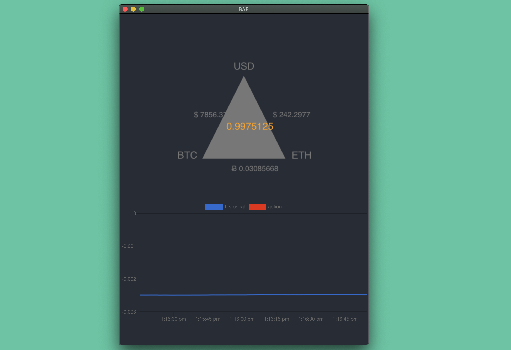
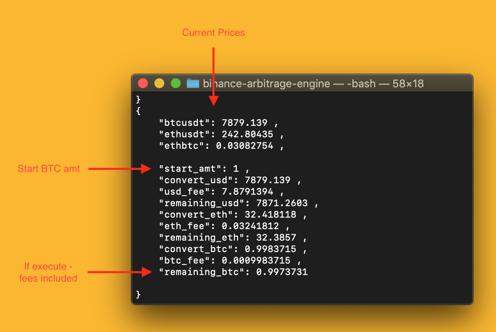

# 😻 binance-arbitrage-engine

Welcome to 😻 BAE

Dedicated to my BAE (image pending) ❤️  


Screenshot of a beta beta beta UI


# What is this?

😻 BAE, is a simple - `safe` - way to check for single exchange arbitrage potentials on Binance. Has simple event based bindings for Python, Node and Golang using zero mq.

What is safe? what is zmq? Don't worry the point is you don't really have to worry about those things. 

✅ The goal is to provide **consistent connection** to the exchange and fast calculations on the current pricing data. We use the lightweight Rust websocket implementation `tungstenite` (contained in the Binance library) to achieve a steady price stream.

✅ Next we want to **calculate the arbitrage potential** - quickly and with fees included. This ends up being simple arithmetic and we can read the logic easily. Heres the actual code.  
```rust
let default_fee_percentage = 0.001;
let a = btcusdt; // one btc to usd // verbose for readability
let b = ethusdt; // on eth to usd
let c = ethbtc; // on eth to btc
let start_amt = 1.0;
// btcs to usdt
let convert_usd = start_amt * a;
let usd_fee = convert_usd * default_fee_percentage;
let remaining_usd = convert_usd - usd_fee;
// usdt to eths
let convert_eth = remaining_usd / b;
let eth_fee = convert_eth * default_fee_percentage;
let remaining_eth = convert_eth - eth_fee;
// eths to btc
let convert_btc = remaining_eth * c;
let btc_fee = convert_btc * default_fee_percentage;
let remaining_btc = convert_btc - btc_fee;
```

✅ Lastly we want to **encapuslate our price listener** from our (not included) business logic. For instance, we might want to build a Python or Node bot around this stream. We'll want to use the real time pricing data from the Rust client - but write our execution logic in a language that is faster to prototype. We achieve this by running the main code as a seperate program that prints the current data in `JSON` to a ZMQ stream. ZQM has clients in practically every language and its simple to add a listener to the stream. [Go Example](client.go) [Node Example](client.js)

# Running BAE
Non optmized (dev mode):
```bash
cargo run
```

Optimized (building will take a few minutes):
```bash
cargo build --release
# - - OUTPUT - - 
# Compiling binance-arbitrage-engine v0.1.0 (/Users/drbh2/Desktop/binance-arbitrage-engine)
# Finished release [optimized] target(s) in 4m 31s
# (base) drbh2s-MBP:binance-arbitrage-engine drbh2$ ./target/release/binance-arbitrage-engine 
./target/release/binance-arbitrage-engine 
```

for (GO):
```bash
go run client.go 
```

for (NODE):
```bash
node client.js 
```

### Running the super beta UI

This is an early stage UI that will update in real time. A Go websocket server connects to the price watcher channel and sends a message to the UI's websocket every update. It also sends the total value after trading - so you can see if its a good time to arbitrage or not.

build the development React webapp
```
cd www
yarn
yarn start
```

start the websocket server
```
cd server
go run simple.go
```

open app in standalone window!
```
go run tiny_ui.go
```

Note: The websocket server doesn't correctly stop sending data after the websocket connection is closed, so you may have to restart your server often to not hinder performance. 


# Data this program provides



#### Market Activity Stream
```JSON
{
    "btcusdt": 7855.3535,
    "ethusdt": 240.30733,
    "ethbtc": 0.03067585,

    "start_amt": 1,
    "convert_usd": 7855.3535,
    "usd_fee": 7.855354,
    "remaining_usd": 7847.498,
    "convert_eth": 32.65609,
    "eth_fee": 0.032656092,
    "remaining_eth": 32.623432,
    "convert_btc": 1.0007515,
    "btc_fee": 0.0010007515,
    "remaining_btc": 0.99975073 
}
```

The second kind of message - either on the same stream or a second one. Can be triggered if the final amount after the 3 trades results in a net gain of more then 1%. This value can be adusted in [src/main.rs](src/main.rs). Basicly if the `remaining_btc` is above 1.01 the execution message is triggered with the expected values needed to execute the arbitrage (not tested). 

#### Execution Engine Stream
```JSON
[
{
	"ticker": "BTCUSDT",
	"amount": 1,
	"price": 7855.3535,
	"action": "SELL"
},
{
	"ticker": "ETHUSDT",
	"amount": 7847.498,
	"price": 240.30733,
	"action": "BUY"
},
{
	"ticker": "ETHBTC",
	"amount": 32.623432,
	"price": 0.03067585,
	"action": "SELL"
},]
```

Note: the above example would result in a net negative investment (this example was not extracted at a good time to arbitrage and is only an example of what the output would look like)  

# What I know about fees
Fee are forsure `0.1% or 0.001` this is provide via Binance docs. But there are many ways to lower these fees - most notably by using BNB. This should be an option in the code - but is not at the moment.


A way to calculate - this website has it explained pretty well

"Binance charges a flat 0.1% fee for executing trades on their exchange, regardless of whether you're buying or selling and using limit or market orders for transactions. The flat fee is applied automatically once a buy or sell order is fulfilled, and is deducted from the end cryptocurrency.

For example, If you bought 1,000 TRX using ETH as the base currency, the 0.1% fee of 1 TRX will be applied and automatically deducted from your order, netting you 999 TRX. Conversely, if you sold all your XLM holdings for exactly 1 BTC, the 0.1% fee of 0.001 BTC will be applied and net you .999 BTC.

To show it in dollar terms, if you bought 10,000 TRX using BTC as the base currency with the going rate of $0.10 per TRX and $10,000 per BTC, you would pay 0.1 BTC ($1,000). Binance will then apply the 0.1% fee in TRX, which would come out to 10 TRX ($1.00), and net you 9,990 TRX ($999).

To turn the tables around, if you exchanged 10,000 TRX for BTC at the same going rate as above, you'd get 0.1 BTC ($1,000). The 0.1% fee would then be applied in BTC, which would come out to 0.0001 BTC ($1.00), netting you 0.0999 BTC ($999). In essence, Binance's flat 0.1% fee means that you'll get charged 1 coin per 1,000, 10 per 10,000, 100 per 100,000, and so on, regardless of which currency you buy or sell." [link](https://smartphones.gadgethacks.com/how-to/binance-101-fees-fine-print-you-need-know-before-trading-bitcoins-other-cryptocurrencies-0182067/)


#### Known Bugs!

🐞 Unknown crash due to intermittent Binance message on websocket and execution fails on parsing as a `f64`
